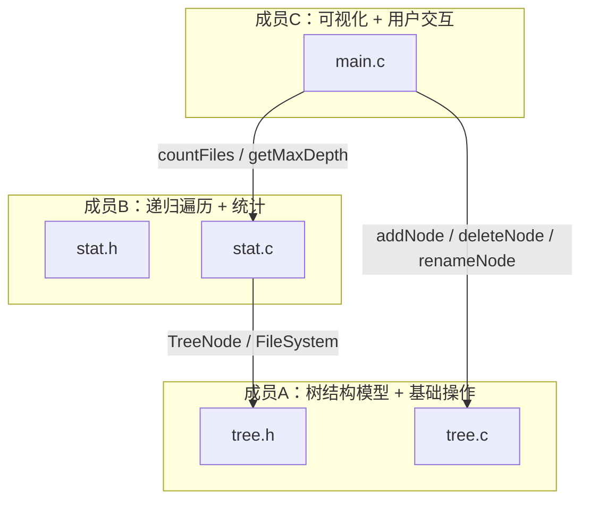

# 简易文件目录树管理系统

C 语言实现，三人小组分工合作。

## 模块结构



## 数据流

```
用户输入 → main.c（菜单调度）
              ├── 增/删/改 ──→ tree.c（操作树结构）
              └── 统计     ──→ stat.c（递归遍历）
                                   └── 依赖 tree.h 的 TreeNode
```

## 文件清单

| 文件 | 成员 | 职责 |
|------|------|------|
| `tree.h` | A | TreeNode / FileSystem 结构定义 + API 声明 |
| `tree.c` | A | 初始化、增删改查、路径查找、内存释放 |
| `stat.h` | B | countFiles / getMaxDepth / traverse 声明 |
| `stat.c` | B | 统计与遍历函数实现 |
| `main.c` | C | 树形可视化打印 + 命令行菜单交互 |
| `test_tree.c` | A | 单元测试（26 用例） |

## 构建

```
cl /utf-8 /Fe:FileTreeManager.exe main.c tree.c stat.c
```

或用 VS2026 打开文件夹，自动识别 CMakeLists.txt，F5 运行。
