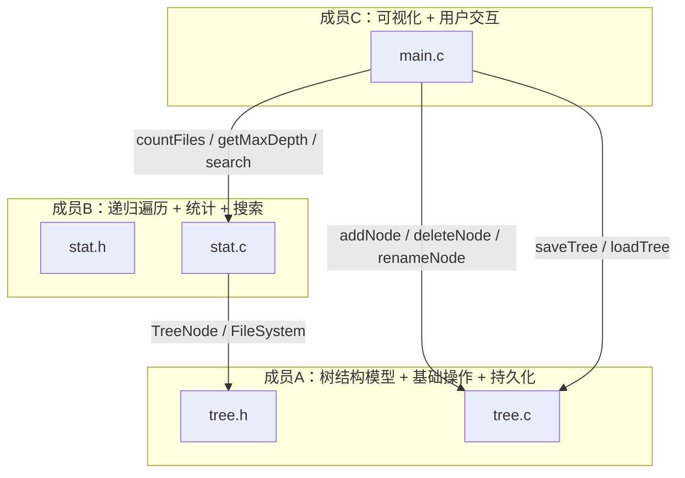

# 简易文件目录树管理系统

C 语言实现，三人小组分工合作。

## 模块结构



## 数据流

```
用户输入 → main.c（菜单调度）
              ├── 增/删/改 ──→ tree.c（操作树结构）
              ├── 统计     ──→ stat.c（递归遍历）
              ├── 搜索     ──→ stat.c（DFS + 关键字匹配）
              ├── 保存     ──→ tree.c（序列化到 tree.dat）
              └── 加载     ──→ tree.c（反序列化恢复）
```

## 功能列表

| 功能 | 选项 | 说明 | 实现者 |
|------|------|------|--------|
| 查看目录树 | 1 | 树形缩进显示（├── └── │） | C |
| 新增节点 | 2 | 在指定路径下创建文件或文件夹 | A + C |
| 删除节点 | 3 | 递归删除节点及其所有子节点 | A + C |
| 重命名节点 | 4 | 修改节点名称（检查同级重名） | A + C |
| 统计信息 | 5 | 文件总数 + 最大文件夹层数 | B + C |
| 搜索节点 | 6 | 按名称模糊搜索（strstr 匹配） | B + C |
| 保存到文件 | 7 | 将整棵树持久化到 tree.dat | A + C |
| 从文件加载 | 8 | 从 tree.dat 恢复树结构 | A + C |
| 自动保存 | 退出时 | 程序退出自动保存 | C |
| 自动加载 | 启动时 | 检测 tree.dat 存在则自动加载 | C |

## 文件清单

| 文件 | 成员 | 职责 |
|------|------|------|
| `tree.h` | A | TreeNode / FileSystem 结构定义 + saveTree/loadTree 声明 |
| `tree.c` | A | 初始化、增删改查、路径查找、内存释放、序列化/反序列化 |
| `stat.h` | B | countFiles / getMaxDepth / traverse / search 声明 |
| `stat.c` | B | 统计与遍历函数、模糊搜索实现 |
| `main.c` | C | 树形可视化打印、命令行菜单交互、搜索/保存/加载界面 |
| `test_tree.c` | A | 单元测试（26 用例） |

## 数据结构

采用 **左孩子-右兄弟** 链表表示法，每个 `TreeNode` 包含：

```
name[256]   — 节点名称
isFile      — true=文件, false=文件夹
parent      — 父节点指针
children    — 第一个子节点
next        — 下一个兄弟节点
```

## 保存文件格式（纯文本）

```
节点名称
类型（0文件夹 / 1文件）
子节点...
子节点...
#END
```

## 构建

```bash
# MSVC
cl /utf-8 /Fe:FileTreeManager.exe main.c tree.c stat.c

# 单元测试
cl /utf-8 /Fe:test_tree.exe test_tree.c tree.c

# 或用 VS2026 打开文件夹，自动识别 CMakeLists.txt，F5 运行
```
